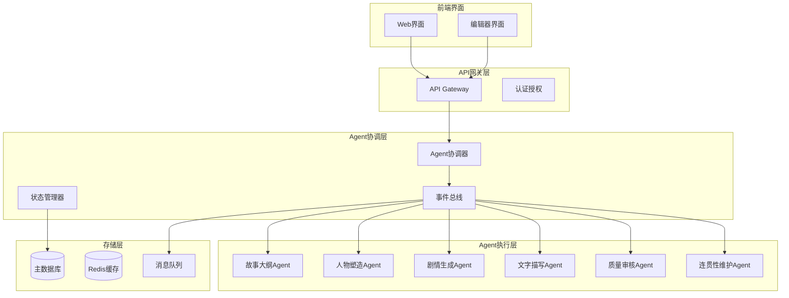
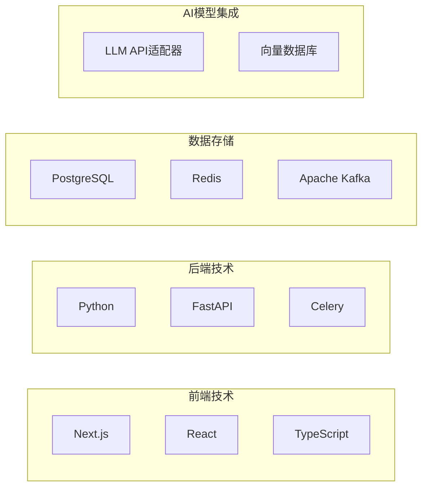
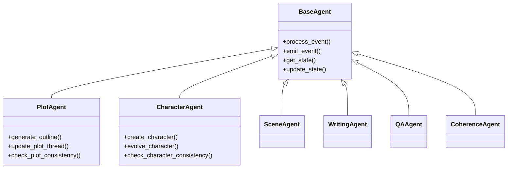
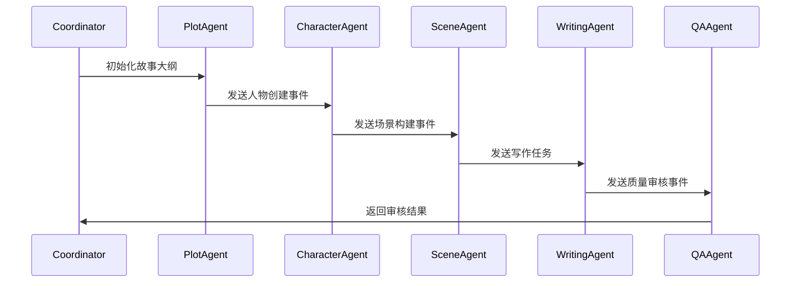
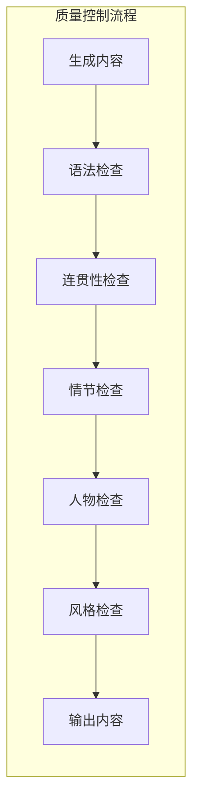

# 多智能体网络小说自动写作系统架构设计

## 目录
- [系统概述](#系统概述)
- [整体架构](#整体架构)
- [技术栈选择](#技术栈选择)
- [详细设计](#详细设计)
- [系统特性](#系统特性)
- [实施计划](#实施计划)

## 系统概述

本系统是一个基于多智能体(Multi-Agent)的网络小说自动写作平台，采用事件驱动架构(EDA)设计模式，旨在生成高质量的长篇网络小说。系统支持多部小说并行生成，具备实时人工干预能力，并实现完善的质量控制机制。

## 整体架构

系统采用微服务架构，分为以下几个核心层次：

## 技术栈选择

### 技术选型说明

1. **前端技术栈**
   - Next.js：提供SSR能力，优化首屏加载
   - React：组件化开发，状态管理
   - TypeScript：提供类型安全
   - WebSocket：实现实时预览和编辑

2. **后端技术栈**
   - Python：AI/NLP处理的最佳语言选择
   - FastAPI：高性能异步API框架
   - Celery：分布式任务队列
   - JWT：身份认证

3. **存储技术栈**
   - PostgreSQL：主数据库，存储结构化数据
   - Redis：缓存层，存储临时数据
   - Kafka：消息队列，事件流处理
   - Milvus：向量数据库，相似度检索

## 详细设计

### Agent系统设计

### 事件流设计

### 质量控制机制

## 系统特性

### 1. 高可扩展性
- 微服务架构设计
- 支持水平扩展的Agent实例
- 可插拔的模型后端
- 动态负载均衡

### 2. 故障恢复
- 事件持久化存储
- 定期状态快照
- 自动重试机制
- 故障转移策略

### 3. 并行处理
- 多小说并行生成
- Agent任务并行执行
- 分布式事件处理
- 异步任务调度

### 4. 实时交互
- WebSocket实时预览
- 实时编辑接入
- 进度监控
- 即时反馈

## 实施计划

### 第一阶段：基础设施搭建（4周）
1. 开发环境配置
2. 数据库设计与实现
3. 消息队列系统搭建
4. API网关构建

### 第二阶段：核心功能开发（8周）
1. Agent框架实现
2. 事件系统开发
3. 状态管理实现
4. AI模型接入

### 第三阶段：前端开发（6周）
1. 用户界面设计
2. 编辑器开发
3. 实时预览实现
4. 交互功能优化

### 第四阶段：质量控制体系（4周）
1. 审核流程实现
2. 测试框架搭建
3. 性能优化
4. 监控系统部署

### 第五阶段：系统集成与测试（4周）
1. 集成测试
2. 性能测试
3. 压力测试
4. 验收测试